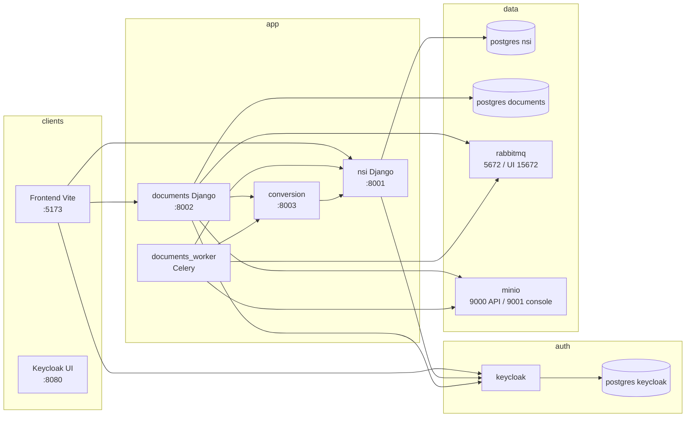
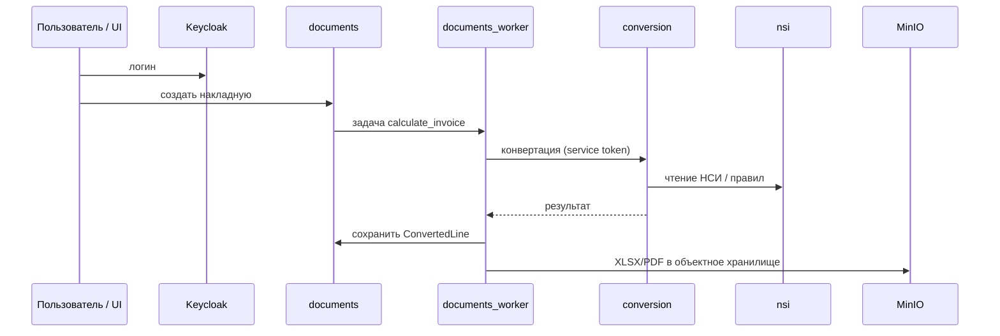

# Converter — обзор-схема (вне аудита СБ)

> **Не использовать для служебки ИБ.** На ветке `sb-security-fixes` источник правды: [`docker-compose.vps.yml`](../docker-compose.vps.yml), [`README.md`](../README.md), [`security-sb-requirements-mapping.md`](security-sb-requirements-mapping.md).

Краткий «дашборд» по архитектуре (схема может содержать устаревшие порты **5672** / **8080**).

---

## 1. Карта сервисов (локальный compose)

---

## 2. Поток накладной (как в RUNBOOK)

---

## 3. Таблица: сервис → порт → назначение

| Сервис | Порт (хост) | Назначение |
|--------|-------------|------------|
| keycloak | 8080 | SSO, realm `uom` |
| nsi | 8001 | НСИ, правила |
| documents | 8002 | Накладные, API файлов |
| conversion | 8003 | Расчёт конвертации |
| rabbitmq | 5672, 15672 | Celery |
| minio | 9000, 9001 | Файлы |
| frontend (profile `ui`) | 5173 | UI |

---

## 4. Health / быстрая проверка

| Проверка | URL / команда |
|----------|----------------|
| NSI | `GET http://localhost:8001/healthz` |
| Documents | `GET http://localhost:8002/healthz` |
| Conversion | `GET http://localhost:8003/healthz` |
| Контейнеры | `docker compose ps` |
| Логи | `docker compose logs --tail 200 documents documents_worker conversion nsi` |

---

## 5. Чеклист «всё живо»

- [ ] `docker compose ps` — все нужные сервисы `running` (и `documents_worker`).
- [ ] Три `/healthz` возвращают успех.
- [ ] Keycloak открывается, realm `uom` на месте (после импорта из `infra/keycloak`).
- [ ] При необходимости: `docker compose run --rm seed` — демо-данные.
- [ ] UI: `docker compose --profile ui up -d frontend` → `http://localhost:5173`.

---

## 6. CI (из README / RUNBOOK)

| Job | Суть |
|-----|------|
| frontend-build | `npm ci && npm run build` |
| python-smoke | проверки Python |
| e2e-smoke | compose + pytest e2e |

---

## 7. Продакшен (вне этого репо)

Код и compose — здесь; **URL, nginx, systemd, секреты на сервере** — по операционному runbook организации (ветка выката у мейнтейнера обычно `test`). В Git не кладут реальные `.env` и ключи.

---

*Файл для просмотра в IDE с превью Mermaid или экспорта в PNG через `mermaid-cli` при необходимости.*
